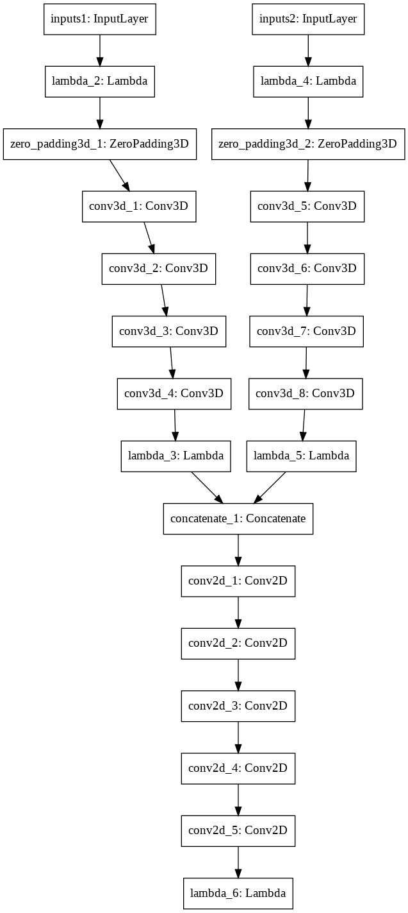

# 3Dconv_LF_depth_estimation
implementation (using keras) of ( Faluvégi, Ágota, et al. "A 3D Convolutional Neural Network for Light Field Depth Estimation." 2019 International Conference on 3D Immersion (IC3D). IEEE, 2019.)

## Implementation env
- Python 3.7.7
- tensorflow==2.3.0
- Keras==2.4.3

```
conda create -n LF_3Dconv python=3.7 anaconda
conda activate LF_3Dconv
```

```
pip install tensorflow==2.3.0 keras==2.4.3
```

The source code for the tensorflow 1.X can be found here.  
https://github.com/catdance124/3Dconv_LF_depth_estimation/tree/1a9a17496fab37cd3ccb237156a78f5cc308e725

## To run
Download light field dataset (from https://lightfield-analysis.uni-konstanz.de/).  

Please set up the file structure as follows.  
```
3Dconv_LF_depth_estimation/
  ┣━━ src/    ...    source codes
  ┣━━ output/    ...    dir for output (this will be created later automatically created.)
  ┣━━ patch_data/    ...    dir for patch data (the data will be created later.)
  ┃     ┣━━ train_data.txt        ...    scenes to use for training
  ┃     ┣━━ validation_data.txt   ...    scenes to use for validation
  ┃     ┗━━ test_data.txt         ...    scenes to use for test
  ┣━━ full_data/    ...    downloaded dataset
  ┃     ┣━━ additional/
  ┃     ┣━━ stratified/
  ┃     ┣━━ test/
  ┃     ┗━━ training/
  ┣━━ plot_result.py    ...    the script to create the figure below
  ┗━━ README.md    ...    this document
```

clone this repo
```
git clone https://github.com/catdance124/3Dconv_LF_depth_estimation.git
cd 3Dconv_LF_depth_estimation/src
```

Create patch dataset(The first time only.)  
```
python ./create_dataset.py
```

Start training
```
python ./train.py
```

## result
The predicts for each epoch are placed here.  
output/YYYY-MM-DD_HHmm/fig/{epoch}.png  
  
Each frame of the following figure was created by [plot_result.py](./plot_result.py).  
I used [Giam](http://furumizo.net/tsu/giamd.htm) to connect each frame and created the following figure.  
```
# after rewrite the output_dir variable in ./plot_result.py
python ./plot_result.py
# save to ./output/YYYY-MM-DD_HHmm/result/{epoch}.png  
```


## model architecture
